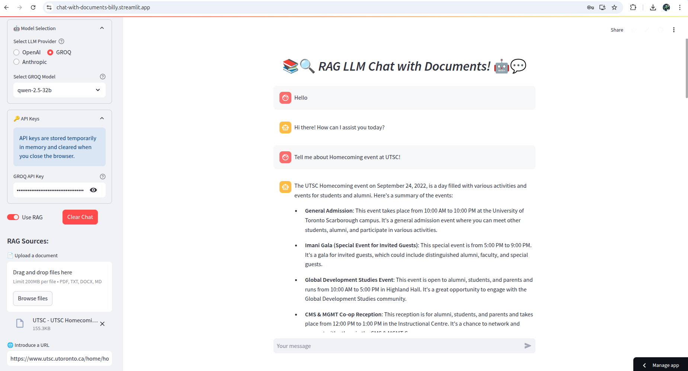

# Chat With Documents

[](https://chat-with-documents-billy.streamlit.app/)  
[](https://github.com/billy-enrizky/chat-with-documents)

**Open it Here!**

[Open it Here](https://chat-with-documents-billy.streamlit.app/)



## Overview

**Chat With Documents** is a Streamlit application that leverages Retrieval-Augmented Generation (RAG) to enable interactive, context-aware conversations with large language models (LLMs). Users can upload documents or provide URLs, and the app indexes the content using a vector store (Chroma) to supply relevant context during chats. The app supports multiple LLM providers including OpenAI, GROQ, and Anthropic.

## Features

- **Interactive Chat Interface:** Engage in a conversation with an LLM enhanced with contextual information from your documents.
- **Document Upload:** Upload files in PDF, TXT, DOCX, or Markdown formats.
- **URL Integration:** Extract and index content directly from webpages.
- **RAG (Retrieval-Augmented Generation):** Combines LLM responses with relevant document context.
- **Multiple LLM Providers:** Choose between OpenAI, GROQ, and Anthropic models.
- **Streaming Responses:** Experience real-time streaming responses for a fluid chat experience.
- **Vector Store Integration:** Uses Chroma for indexing and retrieving document embeddings.

## Demo

Check out the live deployed app: [Chat With Documents on Streamlit](https://chat-with-documents-billy.streamlit.app/)

## Installation

### Prerequisites

- **Python 3.8+** (tested with Python 3.11)
- **Git**

### Setup Steps

1. **Clone the Repository:**

   ```bash
   git clone https://github.com/billy-enrizky/chat-with-documents.git
   cd chat-with-documents
   ```

2. **Create and Activate a Virtual Environment:**

   ```bash
   python -m venv venv
   source venv/bin/activate  # On Windows: venv\Scripts\activate
   ```

3. **Install the Required Dependencies:**

   ```bash
   pip install -r requirements.txt
   ```

4. **Configure Environment Variables:**

   ```dotenv
   OPENAI_API_KEY=your_openai_api_key_here
   GROQ_API_KEY=your_groq_api_key_here
   ANTHROPIC_API_KEY=your_anthropic_api_key_here
   ```
   you can enter these keys via the sidebar in the app.

## Usage

1. **Run the Application:**

   ```bash
   streamlit run streamlit_app.py
   ```

2. **Interact with the App:**
   - **Configure the LLM Provider:** Use the sidebar to select your preferred LLM provider (OpenAI, GROQ, or Anthropic) and model.
   - **Upload Documents or Enter URLs:** Provide documents (PDF, TXT, DOCX, MD) or URLs to supply context.
   - **Chat:** Type your message in the chat input. Depending on your settings, the app will use RAG (if enabled and documents are loaded) or a standard LLM chat to respond.
   - **Toggle RAG:** The "Use RAG" toggle is available in the sidebar once a vector database is initialized with your documents.

## Project Structure

```
chat-with-documents/
├── README.md              # This file
├── requirements.txt       # Python dependencies
├── streamlit_app.py       # Main Streamlit application
└── rag_utils.py           # Utility functions for RAG (indexing, document loading, etc.)
```

## Troubleshooting

### Common Issues

- **`pysqlite3.dbapi2.OperationalError: no such table: collections`**  
  This error indicates that the Chroma vector store is not correctly initialized. It can occur if an old persisted database is used. To resolve:
  - **Delete the Persisted Directory:** Modify the `initialize_vector_db` function to remove any existing directory before initializing a new database.
  - **Run Migration:** Alternatively, follow [Chroma’s migration guide](https://docs.trychroma.com/deployment/migration) to update the schema.

- **`ValueError: Expected Embedings to be non-empty list or numpy array, got [] in upsert.`**  
  This error occurs if empty document chunks are passed to the embedder. Ensure that document splitting filters out empty or whitespace-only chunks.

- **Torch Module Path Error:**  
  If you see errors like:
  ```
  RuntimeError: Tried to instantiate class '__path__._path', but it does not exist!
  ```
  it is due to Streamlit’s local sources watcher inspecting Torch’s custom modules. A monkey-patch can be applied at the very start of your script to safely bypass these errors.

## Contributing

Contributions are welcome! If you’d like to contribute:
1. Fork the repository.
2. Create a new branch (`git checkout -b feature/YourFeature`).
3. Make your changes and commit them (`git commit -m 'Add some feature'`).
4. Push your branch (`git push origin feature/YourFeature`).
5. Open a pull request.

For major changes, please open an issue first to discuss what you would like to change.

## License

This project is licensed under the MIT License. See the [LICENSE](LICENSE) file for details.

## Contact

For any questions or feedback, please open an issue on the [GitHub repository](https://github.com/billy-enrizky/chat-with-documents) or contact the repository owner.

---

Enjoy chatting with your documents!
